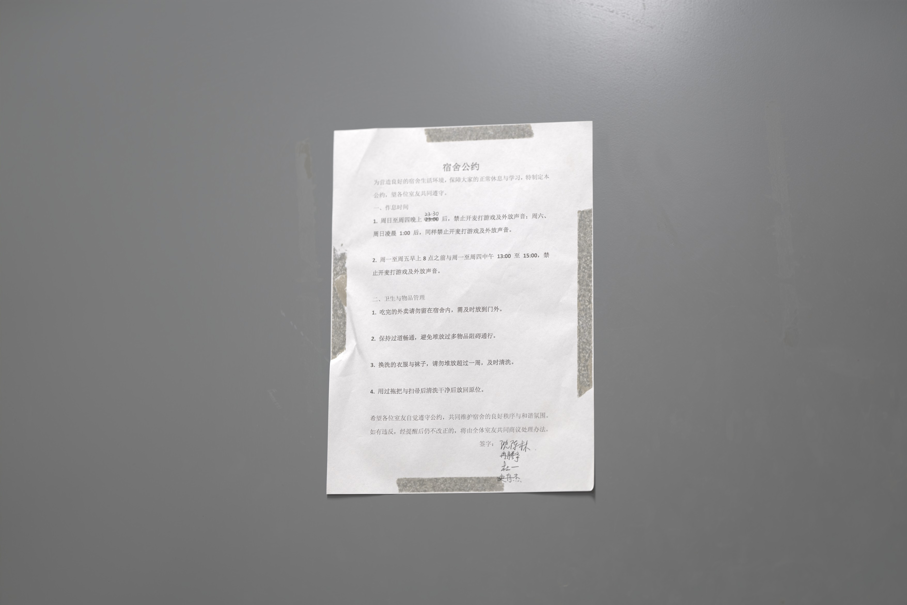

# SRHQ 超分 DNG 解码器

把 **Transformer-JSR 超分管线输出的线性 DNG**（Lightroom / Windows 照片 / LibRaw 均无法打开）
解码渲染为常规 JPG 的小工具。专为下面这套流程定制：

> **相机：Sony A7C II（ILCE-7CM2）**
> **超分管线：Jiangtherapee-Bridge-2.3.8-FastK14-LargeMotion-test-20261002**
> 7 帧 **JSR-stormer · 慢速 · 支持手持包围曝光输入**（整图或局部 · 可选去鬼影 · 内置无损压缩 DNG），
> 实际使用时选择的是「**整体**」模式。

## 为什么需要它

这套管线输出的 DNG 不是普通 Bayer RAW，而是 **LinearRaw**（PhotometricInterpretation=34892）：
图像数据被切成 74 条 **16-bit 无损 JPEG 条带**（SOF3 + Adobe APP14）。主流软件对这种
"LinearRaw + 无损 JPEG 条带"组合的支持是坏的：

- Windows 照片 / Lightroom：打不开
- LibRaw（rawpy）：只解出第一条条带，其余全黑
- Pillow：不识别 SOF3

本工具自己解析 TIFF 结构，用 `imagecodecs` 的 SOF3 无损 JPEG 解码器逐条带解码拼接，
再按 DNG 元数据完成渲染。

## 效果示例

解码结果（1/4 缩放）：



管线模式截图（JSR-stormer 慢速 / 手持包围曝光 / 整体模式）：


## 用法

- **拖放**：把 `.dng` 拖到 `解码.bat` 上 → 命令行直解
- **双击** `解码.bat` → 图形界面（可选批量文件、进度条、自选输出文件夹）
- **命令行**：`python srhq_decoder.py <文件.dng> [更多.dng ...]`

输出（默认与源文件同目录，GUI 可自选输出文件夹）：
- `<原名>_decoded.jpg` — 全分辨率（quality 92）
- `<原名>_decoded_quarter.jpg` — 1/4 缩放预览

单条带损坏会跳过并计数，不会整张报废；不支持的布局会明确报错。

## 安装

需要 Python 3.13+：

```bash
pip install numpy pillow imagecodecs
```

Windows 下仓库自带的 `解码.bat` 会自动设置路径，无需手动安装。
（本机开发环境：Python 3.14 + tkinter GUI，依赖已自包含在 `libs314/`，该目录不入库）

## 渲染流程

```
TIFF 解析（IFD0/SubIFD）
  → 定位 RAW IFD（NewSubFileType=0, Compression=7）
  → 逐条带 SOF3 无损 JPEG 解码拼接
  → 黑位扣除（BlackLevel）
  → 白平衡（AsShotNeutral 增益）
  → 曝光锚点（99.5% 分位 → 0.92）
  → sRGB Gamma → 8bit JPG
```

## 限制

- 只适配"LinearRaw + 无损 JPEG 条带"这一种 DNG 布局
  （即 A7C2 + Jiangtherapee-Bridge 超分输出；其他机型/布局会明确报错）
- 解码速度：131MP 全图约 35~50 秒（瓶颈在无损 JPEG 逐条带解码）

## 结构

```
srhq_decoder.py   解码核心 + CLI + Tkinter GUI
解码.bat           拖放/双击启动器
tests/            GUI 端到端自动化测试（拦截文件对话框驱动真实界面）
docs/             示例图与管线截图
```

## 来源与致谢

超分管线来自 B 站 UP 主 **y-g-jiang**（Jiangtherapee / Transformer-JSR 作者）：

- 📺 软件介绍视频：[https://www.bilibili.com/video/BV1pgam69EKv/](https://www.bilibili.com/video/BV1pgam69EKv/?spm_id_from=333.1387.list.card_archive.click&vd_source=3ecb5c5b08c44781d055358a951c51a5)
- 🔗 作者 GitHub：[https://github.com/y-g-jiang](https://github.com/y-g-jiang)

本仓库只是为该管线输出的 DNG 做了解码渲染工具，超分算法版权归原作者所有。

## License

MIT
